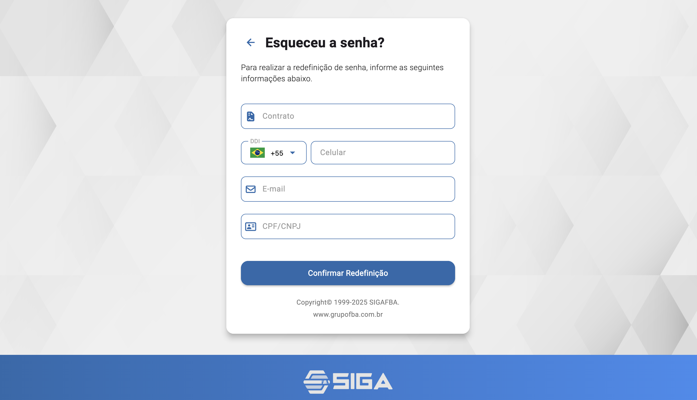

# Esqueceu a senha

## Resumo
Tela de autenticação para acesso ao sistema.

## Principais Ações
Tela para recuperação de acesso via validação de dados pessoais e envio de nova senha temporária.

## Campos
- Contrato: obrigatório. Deve ser o mesmo informado no momento da assinatura; identifica sua instância no sistema.
- Celular (principal): obrigatório. Deve corresponder ao número registrado como principal no cadastro.
- E-mail (principal): obrigatório. Deve corresponder ao e-mail principal do cadastro.
- CPF/CNPJ: obrigatório. Deve corresponder ao documento informado no cadastro.

## Validações e Comportamento
- Todos os campos devem coincidir com as informações de cadastro; divergências impedem o envio da nova senha.
- Em sucesso, o sistema gera uma senha temporária e envia por e-mail e WhatsApp (caso o canal esteja configurado).
- A senha temporária deve ser alterada no primeiro acesso por questões de segurança.

## Relacionados
- Tela de Login (`/entrar`) — ver [Login](./login.md)
- Recuperação de senha.