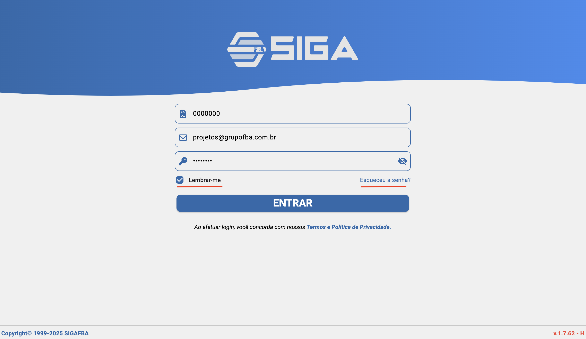
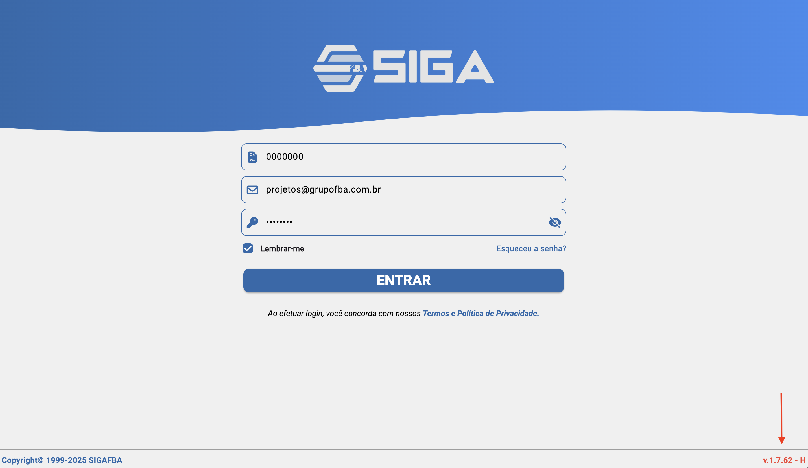

# Entrar 

Tela de autenticação para acesso ao sistema, também referida como tela de login, é onde as autenticações são realizadas, processos para troca de senha e exibição do versionamento do aplicativo, também são validados os termos e serviços de uso.

## Contrato login e senha

**Observação: O contrato, login e senha devem ser fornecidos pelos responsáveis do administrativo do sistema, veja mais em [SIGAFBA Administrativo](/docs/index.md/#sigafba-administrativo)**

## Campos
- Contrato: obrigatório. Enviado ao assinar o contrato; identifica sua instância do sistema.
- Usuário/Email: obrigatório. Configurado no sistema desktop onde se definem acessos e permissões.
- Senha: obrigatório. Uma senha padrão é definida; no primeiro acesso, deve ser alterada. Se esquecer, utilize “Esqueceu a senha?”.
- Lembrar-me: opcional. Ao marcar, as informações de acesso ficam salvas para acessos futuros.

## Ações Secundárias
- Lembrar-me: mantém as credenciais salvas no dispositivo para facilitar o próximo login.
- Esqueceu a senha: abre a tela de recuperação ([Recuperar acesso](./forgotten_password.md)); serão solicitados Contrato, Celular (principal), E-mail (principal) e CPF/CNPJ.

## Versionamento do Aplicativo
- No canto inferior direito é exibida a versão atual do aplicativo.
- Essa informação é essencial para checar novas correções e facilitar suporte.

## Relacionados
- Início (`/inicio`)
- Recuperação de senha — ver [Recuperar acesso](./forgotten_password.md)