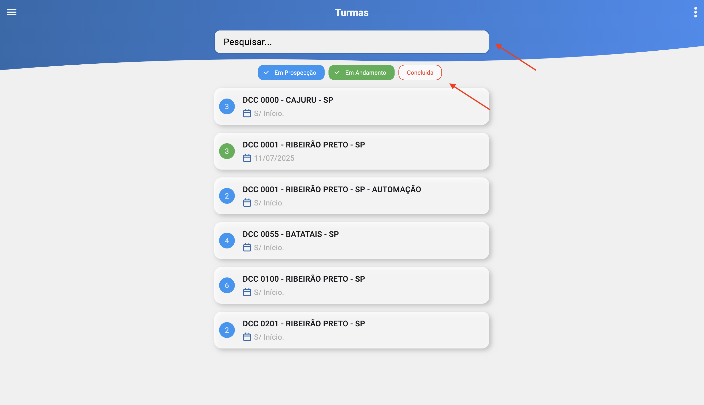

# Turmas (/turmas)

## Resumo
Tela simples para consulta de turmas, com filtros por descrição e status e listagem com informações essenciais.

## Filtros
- Descrição: texto livre para buscar pelo nome/descrição da turma.
- Status: seleção entre:
  - Em Prospecção
  - Em Andamento
  - Concluída

## Listagem de Turmas
Cada item (card) exibe:
- Descrição da turma.
- Data de início.
- Número de participantes.
- Cor do card condizente com o status.

## Status e Cores
- Azul — Em Prospecção.
- Verde — Em Andamento.
- Vermelho — Concluída.

## Relacionados
- Início (`/inicio`)
- Participantes — ver [Participantes](./classes_participants.md)
- Links — ver [Links](./classes_participants_links.md)
- Presença — ver [Presença](./classes_participants_presence.md)
- Novo Link — ver [Novo Link](./classes_participants_links_new.md)
