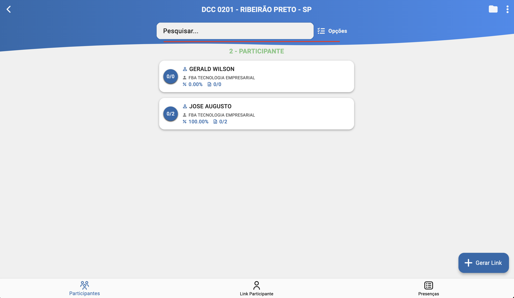
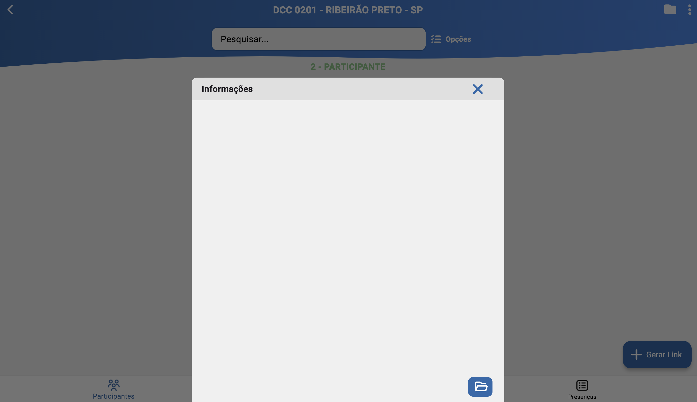
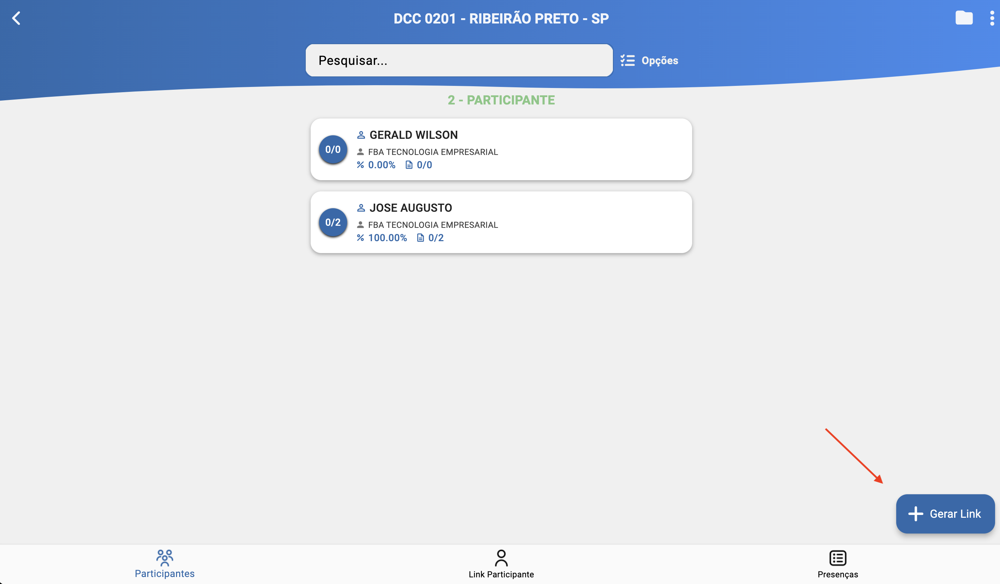

# Participantes da Turma (/turmas/participantes)

## Resumo
Listagem avançada de participantes com filtro por descrição, seleção múltipla e ações em lote (envio de conteúdos, formulários, indicações e mensagens), além de anexos da turma e criação rápida de links de inscrição.

## Principais Ações
- Filtrar participantes por descrição.
- Selecionar múltiplos participantes para envio em lote.
- Enviar conteúdo, formulário, indicação ou mensagem (WhatsApp/E-mail).
- Anexar documentos à turma para consultas futuras.
- Acessar criação rápida de links de inscrição.

## Filtros
- Descrição do participante: busca textual por nome/descrição.

## Seleção Múltipla e Ações
- Seleção múltipla: permite enviar ações em lote para vários participantes simultaneamente.
- Ações disponíveis:
  - Conteúdos: envio de materiais/links relevantes ao participante.
  - Formulário: envio de um link para o participante preencher respostas conforme o formulário selecionado pelo consultor.
  - Indicação: envio de um link para o participante registrar nomes e celulares de indicados para contato do consultor.
  - Mensagem: envio de mensagem padrão ou customizada, com opção de anexos, via WhatsApp ou E-mail.

## Anexos da Turma
- Opção para anexar documentos na turma (documentações, materiais de treinamento, etc.).
- Os anexos ficam visíveis para consultas futuras por usuários autorizados.

## Criação de Links de Inscrição
- Botão de acesso rápido para criar novos links de inscrição.
- Ao criar, é gerado um link que pode ser compartilhado com interessados.

## Listagem de Participantes
Cada item exibe:

- Nome/descrição do participante.
- Informações relevantes (e.g., contato, contrato).
- Estado visual de seleção (checkbox) para ações em lote.

## Relacionados
- Início (`/inicio`)
- Participantes — ver [Participantes](./classes_participants.md)
- Links — ver [Links](./classes_participants_links.md)
- Presença — ver [Presença](./classes_participants_presence.md)
- Novo Link — ver [Novo Link](./classes_participants_links_new.md)