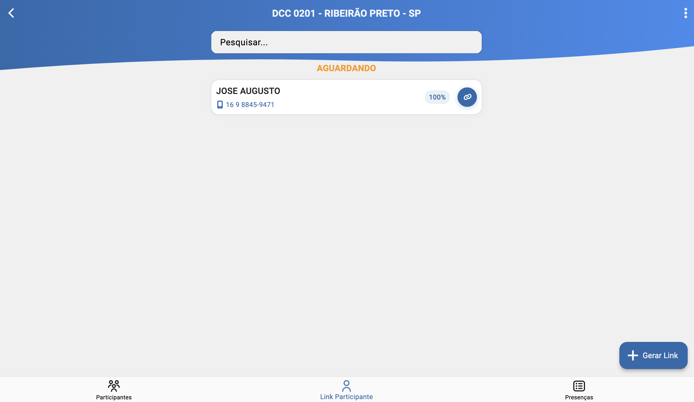
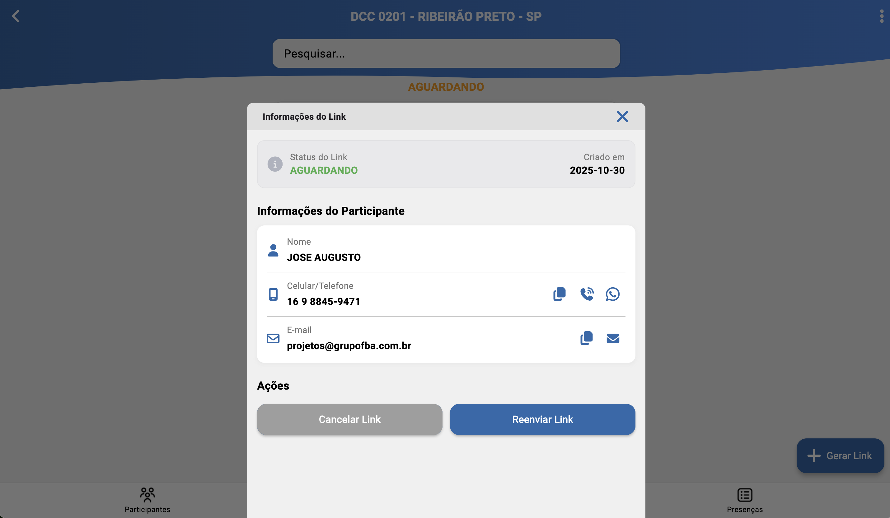

# Links de Participantes (/turmas/participantes/links)

## Resumo
Tela simples de consulta de links, com filtro por descrição, agrupamento por status e ações rápidas (reenvio, nova criação, copiar e excluir).

## Principais Ações
- Copiar link.
- Cancelar link.
- Reenviar link (WhatsApp/E-mail).

## Filtro de Pesquisa
- Campo de busca por descrição do link (texto livre).

## Agrupamento por Status
- Os links são exibidos agrupados de acordo com seu status (por exemplo: pendente, enviado, concluído).

## Detalhe do Item
Ao clicar em um link, são apresentados:

- Descrição do link.
- Participante(s) associado(s).
- Informações que foram preenchidas pelo participante.
- Status atual do link e histórico (se aplicável).

## Ações do Item
- Reenviar link: dispara novamente via WhatsApp ou E-mail.
- Nova criação: gera um novo link baseado no mesmo contexto.
- Copiar link: copia a URL para a área de transferência.
- Excluir link: remove o link (respeitando permissões e regras do sistema).

## Relacionados
- Início (`/inicio`)
- Participantes — ver [Participantes](./classes_participants.md)
- Links — ver [Links](./classes_participants_links.md)
- Presença — ver [Presença](./classes_participants_presence.md)
- Novo Link — ver [Novo Link](./classes_participants_links_new.md)