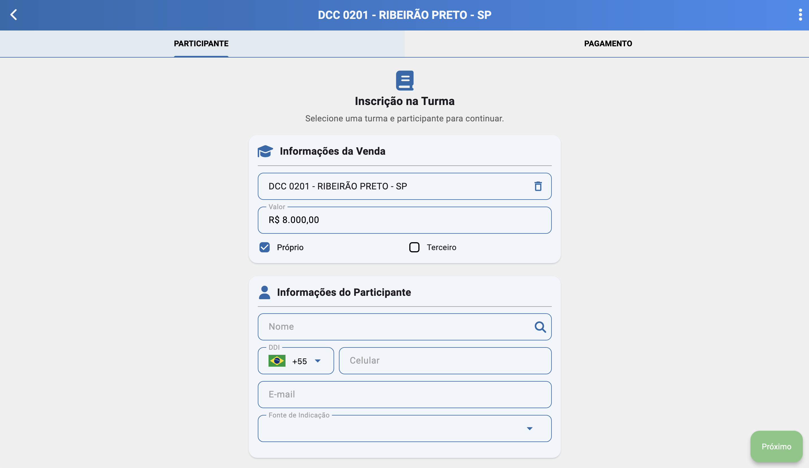
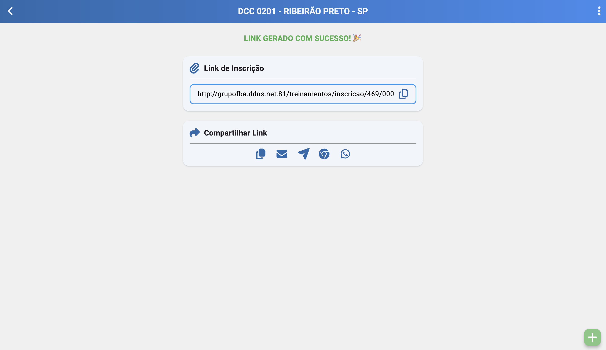

# Novo Link de Inscrição (/turmas/participantes/links/novo)

## Resumo
Tela para geração de link de contrato a ser enviado ao cliente. Ao concluir o preenchimento, são gerados o contrato e os lançamentos financeiros no SIGAFBA ERP.

## Principais Ações
- Gerar link e enviar por WhatsApp/E-mail, copiar ou abrir.
- Definir regras de pagamento (porcentagem, parcelas, formas de cobrança).

## Guia Participante
- Turma: selecionar a turma em que o cliente participará, com valor do curso e tipo da venda (PF/PJ).
- Informações do cliente (participante): duas possibilidades de preenchimento:
  - Sem vínculo prévio: o link não se vincula a uma pessoa até que o participante informe o CPF/CNPJ no formulário do link. Após informar, é criado/vinculado o cadastro.
  - Com vínculo a pessoa existente: selecionar uma pessoa já cadastrada; os dados são pré-preenchidos no link e o participante confirma os dados cadastrais e assina o contrato.

## Guia Pagamento
- Porcentagem do participante:
  - Definir percentuais do valor do curso que o participante pagará.
  - O saldo residual é automaticamente atribuído a um segundo pagante (quando aplicável).
- Tipo de cobrança:
  - Pagamento online (cartão): selecionar a quantidade de parcelas. Ao enviar o link, após o cadastro o cliente terá a tela para pagamento online.
  - Demais formas de pagamento: configuradas pelo consultor (boleto, transferência, etc.). Definir tipo de cobrança, número de parcelas e data da primeira parcela.
- Valor de entrada:
  - Permite definir valor e data de pagamento da entrada.
  - Entrada não pode ser pagamento online.
- Atualização de parcelas:
  - É possível ajustar tipo de cobrança, valor da parcela e data de vencimento de cada parcela antes de gerar o link.
- Integração financeira:
  - Todas as informações de pagamento são clonadas para o SIGAFBA ERP, com cadastro na turma e lançamentos financeiros.

## Geração e Ações do Link
Ao clicar em “Gerar link”, o sistema disponibiliza:

 - Copiar link: copia a URL para área de transferência.
 - Enviar por e-mail: disparo direto pelo sistema.
 - Enviar por WhatsApp: envio automático (se configurado).
 - Abrir link: abre a URL para visualização.
 - Abrir link no WhatsApp: inicia o fluxo de envio via WhatsApp.
 

## Mensagens e Erros Comuns
- Turma não selecionada ou dados do participante incompletos.
- Percentuais de pagamento inválidos (soma não fecha ou regras conflitantes).
- Forma de cobrança indisponível ou não configurada.
- Erro ao gerar link ou ao enviar (WhatsApp/E-mail).
- Falha ao criar contrato ou lançar financeiros no SIGAFBA ERP.

## Relacionados
- Início (`/inicio`)
- Participantes — ver [Participantes](./classes_participants.md)
- Links — ver [Links](./classes_participants_links.md)
- Presença — ver [Presença](./classes_participants_presence.md)
- Novo Link — ver [Novo Link](./classes_participants_links_new.md)