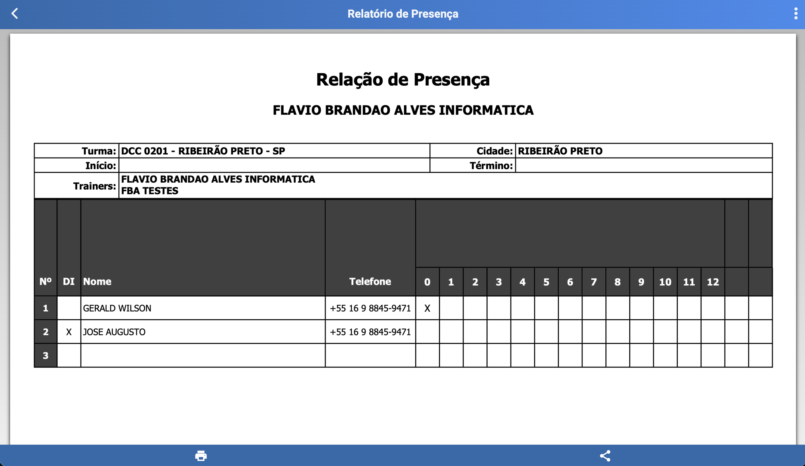

# Presença de Participantes (/turmas/participantes/presenca)

## Resumo
Tela para gestão de presença por sessão, com seleção da sessão atual, alteração de data quando necessário, marcação/remoção de presença por participante e geração de relatório consolidado.

## Principais Ações
- Selecionar a sessão atual.
- Alterar a data da sessão (quando necessário).
- Gerar relatório de presença com todas as sessões e marcações.

## Sessão Atual
- Seletor de sessão (ex.: Sessão 1, Sessão 2, etc.).
- Campo para alteração da data da sessão, permitindo correção ou reagendamento.

## Marcação de Presença
- Clique em cada participante para aplicar ou remover presença.
- O estado visual indica claramente se está presente ou ausente.
- Suporta marcação em lote (se aplicável pela interface).

## Relatório de Presença
- Botão para gerar relatório com todas as sessões e suas respectivas marcações.
- Exporta/visualiza um consolidado com quem esteve presente em cada sessão.

## Relacionados
- Início (`/inicio`)
- Participantes — ver [Participantes](./classes_participants.md)
- Links — ver [Links](./classes_participants_links.md)
- Presença — ver [Presença](./classes_participants_presence.md)
- Novo Link — ver [Novo Link](./classes_participants_links_new.md)