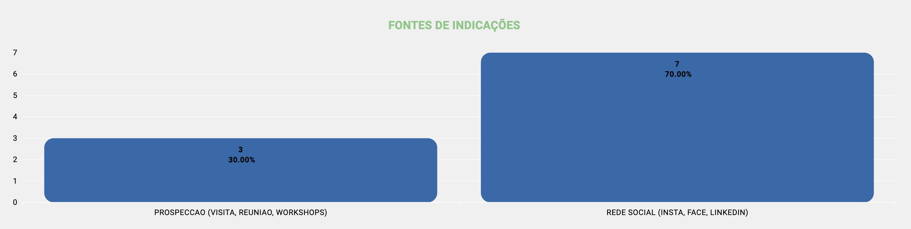
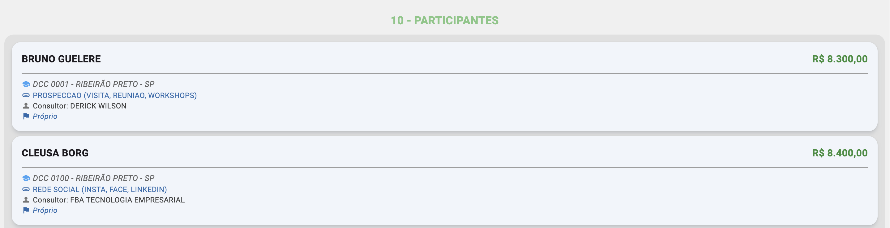
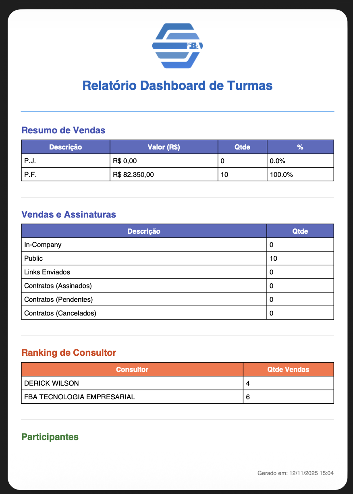

# Dashboard de Turmas (/dashboard/turmas)

## Resumo
Dashboard mais completo do sistema, contemplando toda a parte de vendas da turma e a visualização detalhada dos participantes, com indicadores, rankings e relatório consolidado.

## Indicadores da Turma
- Tipo de venda: PF e PJ com contagem separada de vendas.
- Valor total vendido (R$): somatório consolidado no período selecionado.
- Percentuais por tipo de venda: participação de PF e PJ no total vendido.
- Tipos de curso vendidos: distribuição entre In-Company e Público.
- Contratos e links enviados: totais para análise do volume que ainda precisa ser conferido/avaliado.

## Ranking de Vendas
- Visualização do top de vendas por quantidade, com destaque para os melhores desempenhos.
- Pode ser filtrado por período e/ou turma.

## Ranking de Indicações
- Quantidade de vendas realizadas por tipo de indicação (ex.: campanhas, indicações diretas, orgânico).
- Ajuda a identificar quais fontes geram maior impacto.

## Listagem de Participantes
Cada item da lista apresenta:
- Valor da venda.
- Turma associada.
- Tipo de indicação.
- Consultor responsável pela venda.
- Tipo de venda (PF/PJ).

## Relatórios
- Exportação com as informações do dashboard, conforme filtros aplicados.
- Formatos: PDF e Excel.
- Conteúdo: indicadores, rankings e listagem (com campos essenciais).

## Relacionados
- Início (`/inicio`)
- Funil de Vendas — ver [Funil de Vendas](./sales_funil.md)
- Dashboard de Turmas — ver [Dashboard de Turmas](./dashboard_classes.md)
- Dashboard de Eventos — ver [Dashboard de Eventos](./dashboard_events.md)