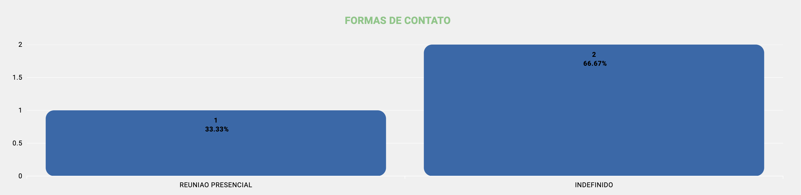

# Dashboard de Eventos (/dashboard/eventos)

## Resumo
Painel focado na identificação e acompanhamento dos eventos lançados, permitindo visualizar status, volume, responsáveis e formas de contato, além de listar eventos realizados e esquecidos.

## Agrupamento por Status
- Visão consolidada da quantidade de eventos por status, com percentuais.
- Informativo adicional: quantos eventos possuem negociações vinculadas e quantos não possuem, para análise de conversão do esforço.
- Ajuda a entender onde estão concentrados os eventos e quais tipos mais recorrentes.

## Ranking de Top Visitas
- Ranking dos usuários que realizaram maior número de eventos (visitas) conforme filtros aplicados.
- Apoia a identificação de maior produtividade e esforço comercial.

## Ranking das Formas de Contato
- Distribuição por forma de contato (WhatsApp, ligação, e-mail, presencial).
- Indica quais canais estão sendo mais utilizados nas interações.

## Listagem de Eventos
- Lista de eventos realizados e eventos esquecidos conforme filtros.
- Card exibe informações essenciais: descrição, data, observação do evento, responsável e status.

## Relacionados
- Início (`/inicio`)
- Funil de Vendas — ver [Funil de Vendas](./sales_funil.md)
- Dashboard de Turmas — ver [Dashboard de Turmas](./dashboard_classes.md)
- Dashboard de Eventos — ver [Dashboard de Eventos](./dashboard_events.md)