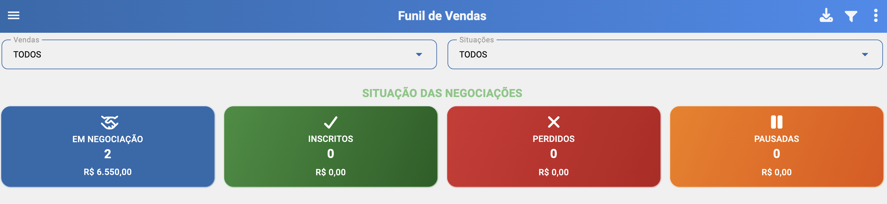
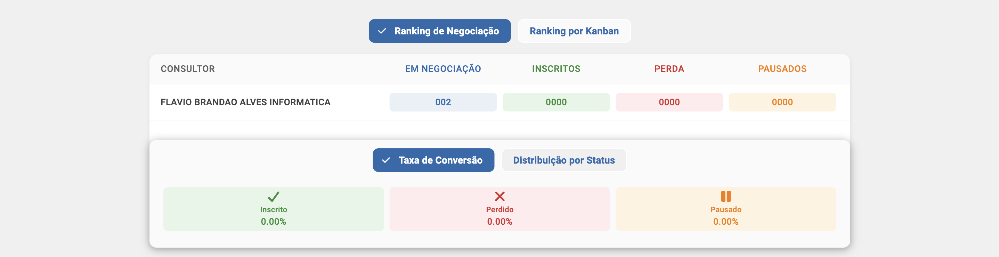
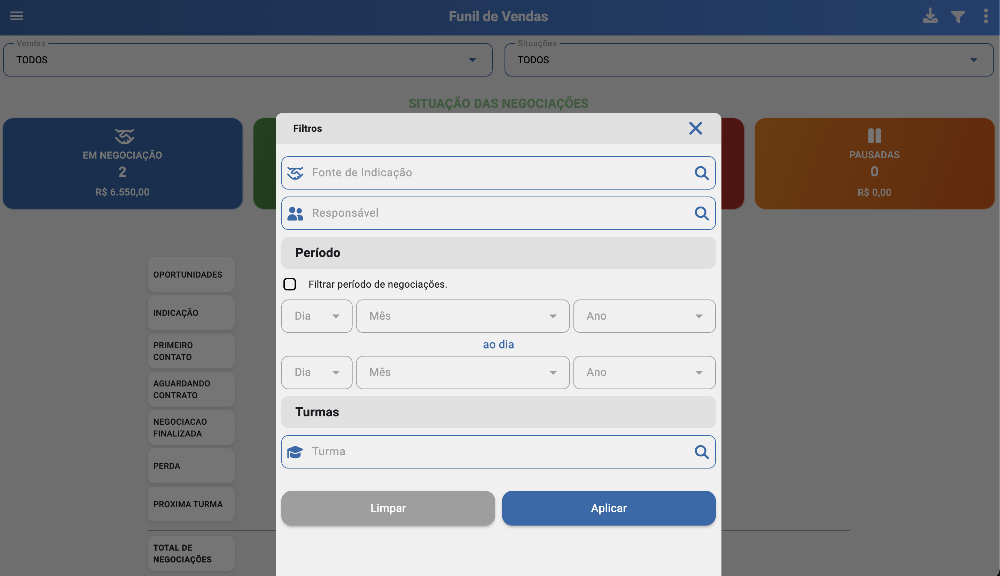
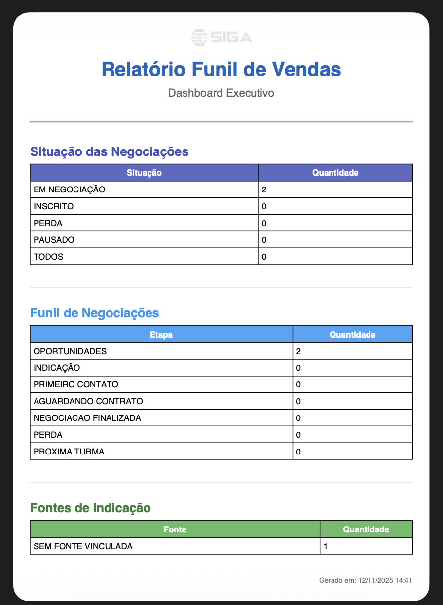

# Funil de Vendas (/dashboard/funil-vendas)

## Resumo
Tela de análise das negociações por etapas do funil, com visão de status, fluxo de venda e fontes de indicação. Foco em métricas de quantidade e valores para apoiar decisões comerciais.

## Indicadores por Situação
- Quantidade de negociações por situação.
- Somatório de valores por situação.
- Leitura rápida para identificar gargalos e oportunidades de melhoria na abordagem.

## Funil de Negociações
- Cards por etapa do funil, com a quantidade de negociações em cada card.
- Somatório total de valores por etapa.
- Independente do status final, a visão consolida o volume por etapa para entender a distribuição.

## Gráfico de Indicação
- Percentual de entradas por fonte de indicação.
- Permite identificar quais origens geram mais oportunidades e valor.

## Ranking de Negociações e Ranking por Kanban
- Ranking de inserções de negociações (por usuário, equipe ou origem).
- Taxas de conversão por status da venda.
- Ajuda a comparar performance e efetividade ao longo do processo.
- Indicativo de volume e progresso por quadros/kanban.
- Taxas de conversão observáveis por etapa do kanban, independente do status final.
- Visão complementar ao funil para gestão operacional.

## Negociações Inseridas
- Número de negociações inseridas por usuário.
- Métrica independente de quem é o consultor vinculado atualmente na negociação. 

## Filtros
- Venda: buscar por curso, turma ou lead.
- Situação: etapas/status da venda.
- Período: datas de criação/atualização/fechamento.
- Fonte de indicação: origem do lead (campanha, indicação, orgânico, etc.).

## Relatórios
- Exportação em PDF e Excel com base nos filtros aplicados.
- O relatório contém os itens exibidos no dashboard (indicadores, funil, rankings e gráfico de indicação).

## Relacionados
- Início (`/inicio`)
- Funil de Vendas — ver [Funil de Vendas](./sales_funil.md)
- Dashboard de Turmas — ver [Dashboard de Turmas](./dashboard_classes.md)
- Dashboard de Eventos — ver [Dashboard de Eventos](./dashboard_events.md)
