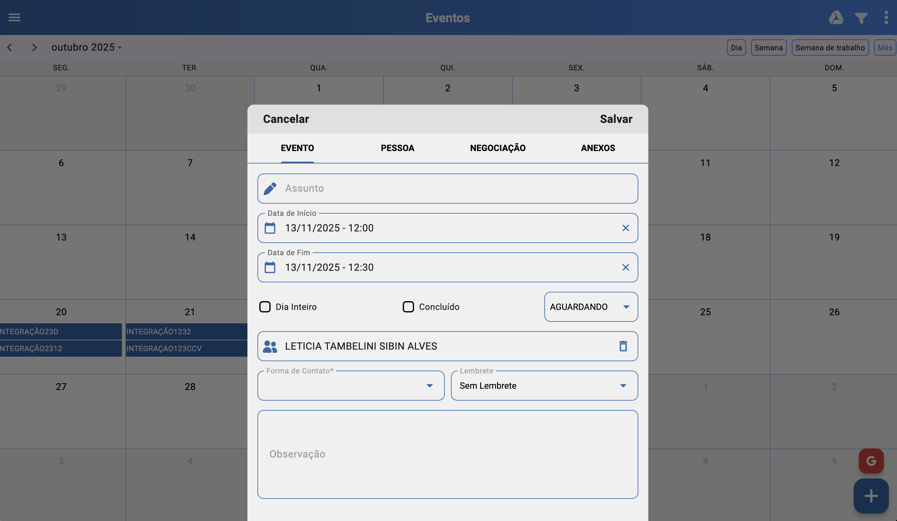
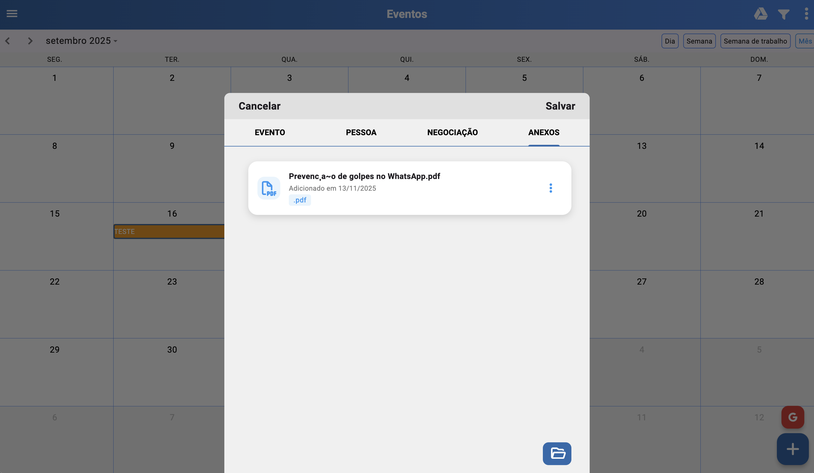

# Eventos (/eventos)

## Resumo
Calendário para gestão de tempo e organização de compromissos com participantes. Permite criar eventos, vincular pessoas e negociações, anexar documentos, filtrar por status/tipo e integrar com Google para visualização.

## Visualização do Calendário
- Visualização padrão: mensal.
- Modos disponíveis: dia, semana, semana de trabalho e mês.
- Ao alterar o tipo de visualização, a preferência é salva para futuras visitas.

## Filtros
- Status: Aguardando, Cancelado, Concluído, Todos, Google.
- Tipo do evento: Com negociação, Sem negociação.
- Objetivo: focar nos compromissos relevantes e facilitar o acompanhamento do relacionamento com o cliente.

## Inserir Evento

### Guia Evento
- Criação sem vínculo obrigatório: assunto, data de início e fim (suporte a “dia inteiro”).
- Status inicial: Aguardando (alterável conforme andamento).
- Responsável pelo evento (se o usuário for gestor).
- Forma de contato: tipo de contato com o cliente (WhatsApp, ligação, e-mail, presencial; cadastrável no SIGAFBA ERP).
- Lembrete: notificação se habilitado nas configurações.

### Guia Pessoa
- Seleção de pessoa existente ou pré-cadastro se não estiver no sistema.
- Ao vincular uma pessoa, o evento entra no histórico de relacionamento do cliente.

### Guia Negociações
- Requer pessoa selecionada para habilitar negociações.
- Se existirem negociações vinculadas à pessoa, são listadas para seleção.
- Caso não haja, é possível cadastrar nova negociação.
- O evento permanece vinculado à pessoa e à negociação, enriquecendo o histórico.

### Guia Anexo
- Vincula anexos como orçamentos ou documentações relevantes ao evento.
- Uso opcional para manter cadastro mais completo.

## Relacionados
- Início (`/inicio`)