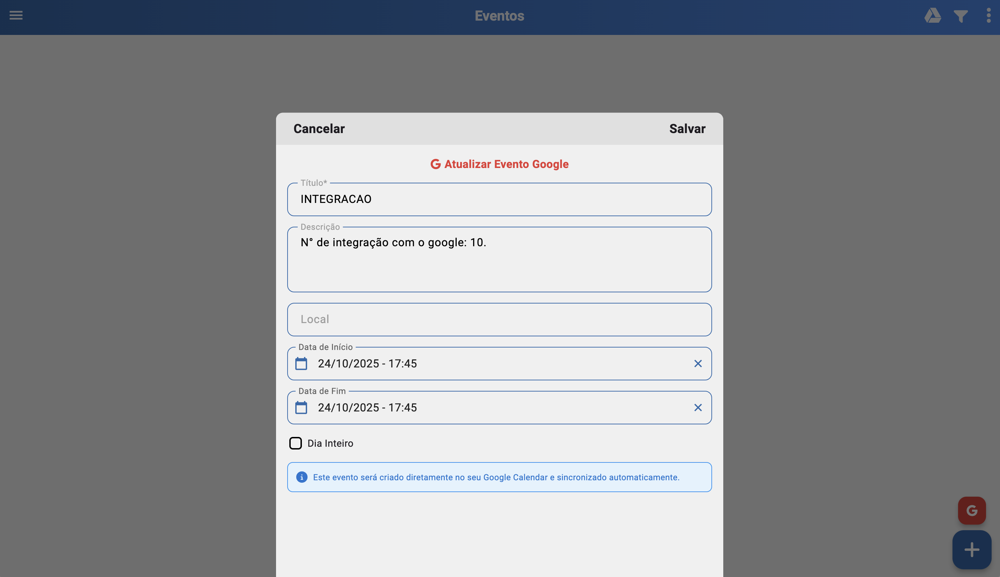
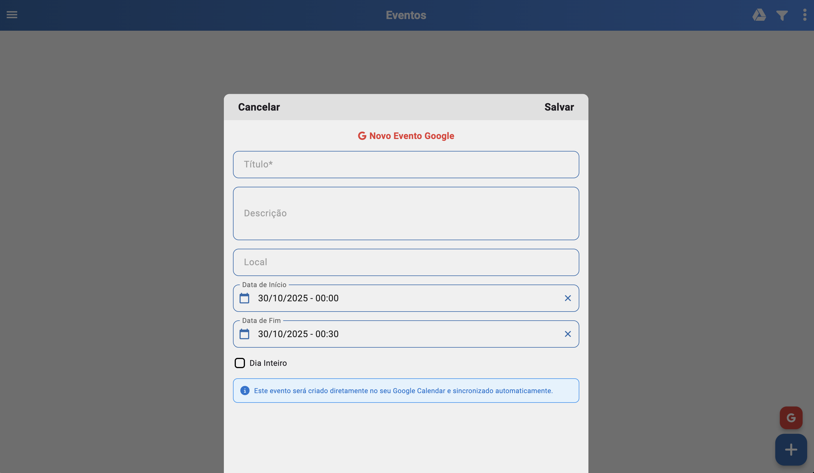

# Integração de Eventos (Google) (/eventos/integracao)

## Resumo
Integração com Google para exibir eventos do calendário diretamente no sistema. Permite vincular a conta Google, carregar eventos automaticamente ao acessar a tela e adicionar novos eventos no Google com informações básicas. A visualização de eventos do Google no sistema é somente leitura.

## Pré-requisitos
- Conta Google válida com acesso ao Google Calendar.
- Configuração da conta em Configurações → Integrações.
- Permissões concedidas para leitura/escrita conforme as ações desejadas (visualização sempre habilitada; criação exige permissão de escrita).

## Vincular Conta Google
- No canto superior direito da tela de Eventos existe a opção de vincular sua conta Google.
- Ao concluir o vínculo, seus eventos do Google passam a ser exibidos no calendário do sistema.

## Sincronização Automática
- Ao entrar na tela de Eventos, o sistema carrega automaticamente os eventos do Google.
- Caso o login do Google tenha expirado (curto período de autenticação), será solicitado um novo login para continuar a sincronização.
- Os eventos do Google são exibidos no calendário do sistema em modo somente leitura.
- Não é possível editar ou excluir eventos do Google diretamente pelo sistema; alterações devem ser feitas no Google Calendar.

## Adicionar Evento no Google
- Na parte inferior da tela de Eventos há a opção de adicionar um evento diretamente no Google.
- A integração contempla informações básicas:
  - Título/Assunto
  - Data de início e fim (com suporte a “dia inteiro”)
  - Descrição/observações
  - Local (se disponível)
- Após salvar, o evento é criado no Google e aparecerá na próxima sincronização.

## Relacionados
- Início (`/inicio`)