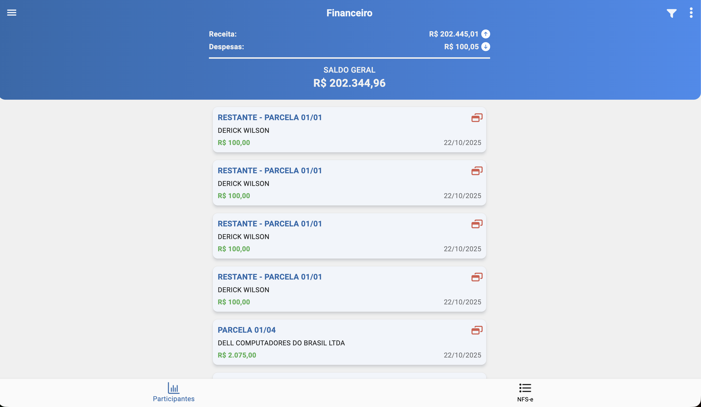

# Financeiro (/financeiro/v2)

## Resumo
Módulo financeiro versão 2, com gestão de cobranças, pagamentos e relatórios.

## Principais Ações
- Conferir pagamentos.
- Consultar NFSe emitidas e concluídas.

## Visão Geral (Receitas, Despesas e Saldo)
- Totais consolidados:
  - Receita (R$): soma dos recebimentos no período.
  - Despesa (R$): soma dos pagamentos/saídas no período.
  - Saldo geral (R$): receita – despesa.
- Atualiza conforme filtros de período/status.
- Destaque visual para fácil leitura dos valores.

## Detalhe do Lançamento
- Exibe informações adicionais:
  - Forma de cobrança/pagamento.
  - Parcelas (se aplicável).
  - Observações e documentos vinculados.
- Uso voltado à análise, sem edição nesta tela de consulta.

## NFSe (Notas Fiscais de Serviço)
- Visão de notas lançadas e concluídas:
  - Indicadores: total lançadas, total concluídas, pendentes.
- Listagem:
  - Número da nota, cliente, competência, valor, status, data.
- Ações:
  - Clique na nota para abrir detalhes e baixar PDF para impressão.

## Relacionados
- Início (`/inicio`)