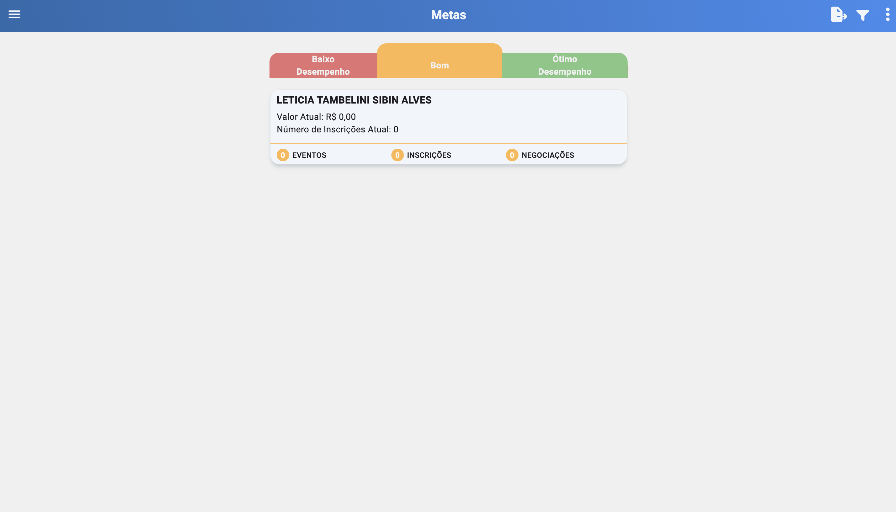

# Metas (/metas)

## Resumo
Gerenciamento de metas sobre Eventos, Inscrições e Negociações, com visão de desempenho, classificação automática (Baixo/Bom/Ótimo) e cadastro de novas metas por período, curso/turma, tipo de venda e condição.

## Objetivo
- Acompanhar números de eventos, inscrições e negociações realizadas.
- Identificar pontos de melhoria para atingir objetivos finais.
- Cadastrar metas e acompanhar progresso por filtros e períodos.

## Primeira Tela: Desempenho
- Considera o valor de vendas e o número de inscrições realizadas.
- Indicativos principais:
  - Eventos: totais por status (atingidas, em andamento, não atingidas).
  - Inscrições: totais por status.
  - Negociações: totais por status.

## Classificação Automática
- Classificação: “Baixo Desempenho”, “Bom”, “Ótimo Desempenho”.
- Atribuição baseada no somatório das metas e média ponderada pelos status:
  - Metas não atingidas pesam negativamente.
  - Metas em andamento têm peso intermediário.
  - Metas atingidas pesam positivamente.

## Cadastro de Metas
Ao acessar a tela de cadastro:

- Meta de:
  - Inscrição: usa inscrições da turma conforme período selecionado.
  - Negociações: usa negociações conforme período selecionado.
  - Eventos: usa eventos do período selecionado (não incluir cancelados).
- Tipo (período):
  - Semanal, Mensal, Período (data customizada), Turma (período completo da turma).
- Condição da meta:
  - “Menor ou igual” / “Menor”: valor alvo máximo; se não atingir esse valor, meta fica em vermelho.
  - “Maior ou igual” / “Maior”: valor alvo mínimo; deve ser maior/igual ao valor para considerar atingida.
- Curso e Turma:
  - Vincular a curso/turma específicos para filtrar somente esse contexto.
- Tipo da venda:
  - In-Company ou Public. Considera apenas registros com o tipo selecionado.

## Regras de Cálculo
- Inscrições: contabiliza inscrições efetivadas no período/turma.
- Negociações: contabiliza no período selecionado (criação/atualização/fechamento conforme regra do sistema).
- Eventos: contabiliza eventos realizados (exclui cancelados).
- Condições:
  - Menor/Menor ou igual: meta focada em redução (ex.: reduzir cancelamentos).
  - Maior/Maior ou igual: meta focada em aumento (ex.: aumentar inscrições).

## Relatório de Metas
- Exportação de relatório (PDF/Excel) com foco em metas realizadas.
- Agrupamento das metas concluídas por tipo (Eventos, Inscrições, Negociações) e período.
- Inclusão das datas de realização de cada meta, para análise temporal de desempenho.
- Campos sugeridos: tipo da meta, período, valor/meta alvo, valor realizado, data de realização, curso/turma (se houver).

## Relacionados
- Início (`/inicio`)