# Negociações

A tela de **Negociações** é responsável por gerenciar as prospecções em formato de _kanbans_ e _leads_. Nesta área, o usuário pode visualizar e acompanhar o andamento das oportunidades de venda, organizadas de acordo com as etapas do funil de negociação, desde o primeiro contato até a conclusão da movimentação (venda finalizada ou perda da oportunidade).

Além disso, a tela permite o acompanhamento da carteira de clientes, facilitando o controle das interações e o histórico de negociações realizadas. Dessa forma, o usuário tem uma visão ampla e dinâmica de todo o processo comercial, podendo identificar oportunidades em aberto, clientes em prospecção e o estágio atual de cada negociação.

_(Imagem meramente ilustrativa. A ordenação, cores e título dos kanbans são totalmente parametrizáveis através do [SIGAFBA Administrativo](../../index.md/#sigafba-administrativo))_

## Pesquisar

Barra de busca responsável por trazer os _cards_ de acordo com o que está sendo filtrado e exibido na tela de negociações.

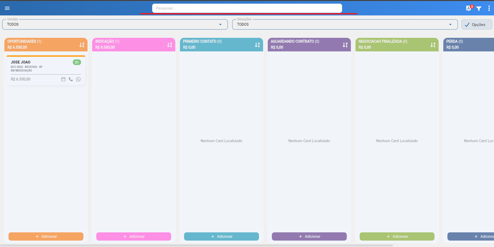

## Negociações de campanha

Essa tela serve para indicar os _leads_ que são trazidos para o sistema por meio de campanhas configuradas pelo administrativo do sistema ou importadas através de ações de _marketing_.

Ao clicar no ícone de aprovação de _Leads_ (caso o parâmetro esteja ativo), é exibido um menu que mostra os _Leads_ para aprovação com telefone e e-mail em status pendente. Ao clicar no ícone de confirmação ou rejeição, eles são automaticamente enviados para as abas de aprovados e reprovados, para consulta posterior.

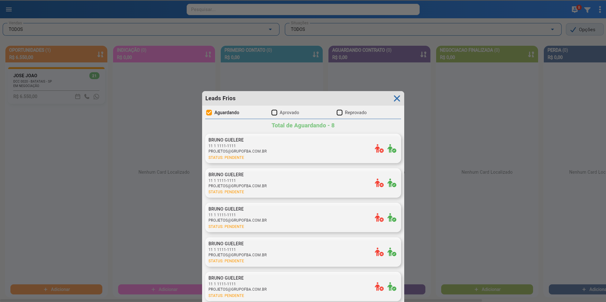

## Filtros

A tela de **Filtros** permite realizar buscas parametrizadas entre os _leads_, facilitando o gerenciamento e a localização de informações específicas dentro das negociações.

## Vendas/Situação

Filtragem referente às turmas, cursos e status de negociações presentes na tela, exibindo conforme o que estiver configurado no [filtro](#filtros).

## Opções

O botão de **Opções** traz alguns recursos para manipulação dos _cards_ em negociação, permitindo ao usuário:

- [Movimentar](#movimentar)
- [Enviar mensagem](#enviar-mensagem)
- [Exportar](#exportar)

As negociações podem ser selecionadas individualmente ou em grupo, permitindo ações em momentos diferentes da venda, ou sobre todas as negociações de uma etapa do negócio.

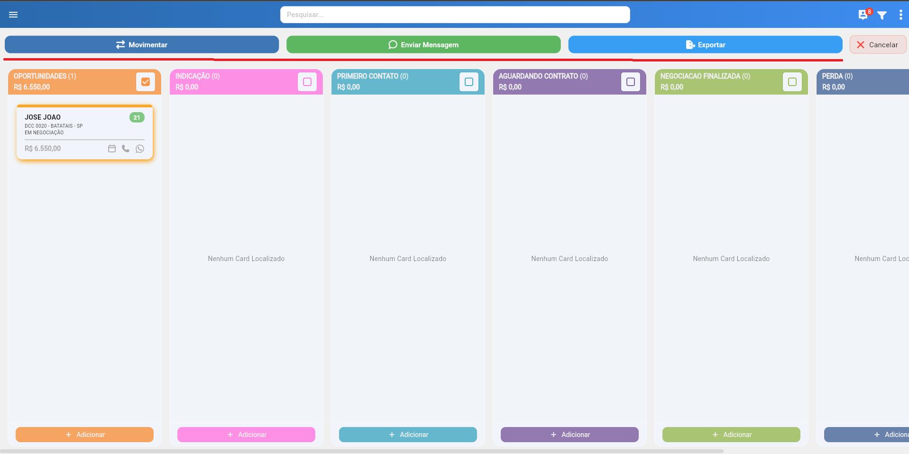

### Movimentar

Ao selecionar a opção **Movimentar**, os _cards_ previamente selecionados podem ser alterados dentro das etapas da negociação, permitindo a troca de:

- Curso  
- Turma  
- Lead (retornar a negociação para um prospecto em branco)  
- Situação (inscrito, em negociação, perda ou pausado)  
- Responsável (apenas para usuários Master)  
- Kanban  
- Município  

### Enviar mensagem

Permite o envio de mensagens em lote para as negociações selecionadas, utilizando uma instância do WhatsApp* ou e-mail com anexo.

_*Para mais informações sobre instâncias, leia em [Configurações](../settings/settings.md)._

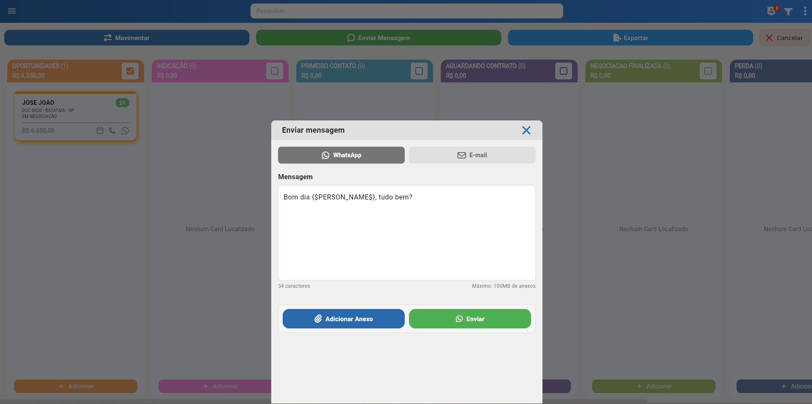

### Exportar

Exporta todas as negociações (atualmente não é possível filtrar negociações específicas) para uma planilha em formato _Excel_ ou _PDF_.

## Ordenação

Permite alterar a ordenação das negociações, exibindo as mais recentes ou mais antigas primeiro.

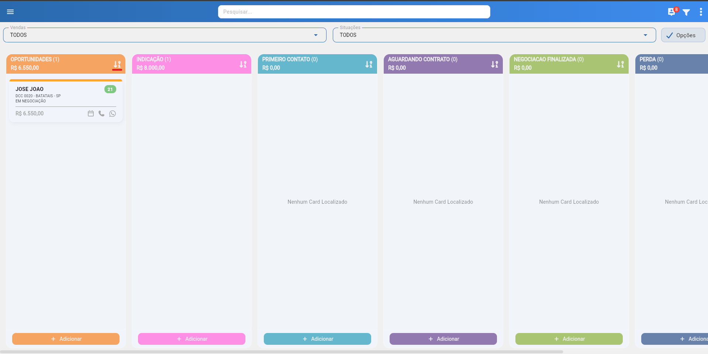

## Dias sem contato

Indicativo visual que mostra quais negociações estão sem [eventos](../../routes/events/events.md) por uma faixa de dias (definida no [Administrativo](../../index.md/#sigafba-administrativo)), utilizando cores verde, amarela e vermelha.

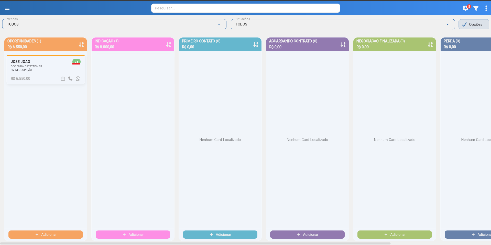

## Atalhos

Permite, de maneira rápida:

- Agendar um [evento](../../routes/events/events.md) com a pessoa da negociação;  
- Realizar uma chamada com a negociação;  
- Abrir o WhatsApp da negociação em uma nova guia.  

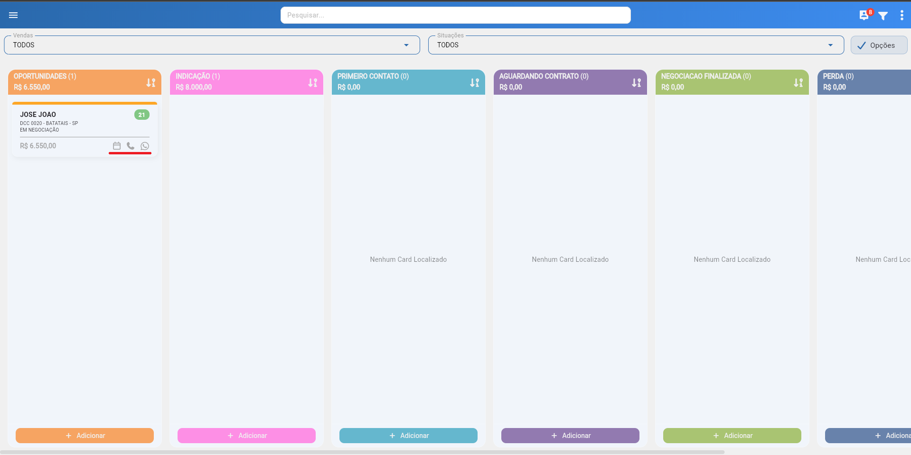

## Adicionar

Botão que possibilita a inserção de novas negociações no sistema de forma manual, inserindo informações referentes à prospecção e ao participante, como curso, turma, observação, valores, entre outros.

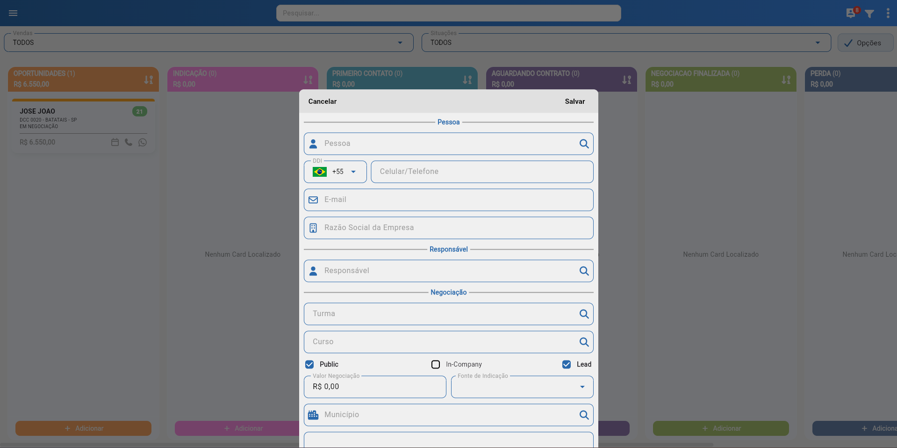

## Informações

Esta é a tela onde as informações da negociação são inseridas, exibindo também seu status, nome, dados pessoais e de interesse do usuário.  
A tela é dividida em quatro abas:

- [Negociação](#negociacao)  
- [Eventos](#eventos)  
- [Anexos](#anexos)  
- [Linha do tempo](#linha-do-tempo)  

### Negociação

Exibe todas as informações referentes à negociação selecionada, trazendo dados pessoais, status, tipo de negociação, observações, certificações anteriores, anotações de contato (_eventos_ rápidos) e a possibilidade de fechar a negociação ou agendar um evento completo.

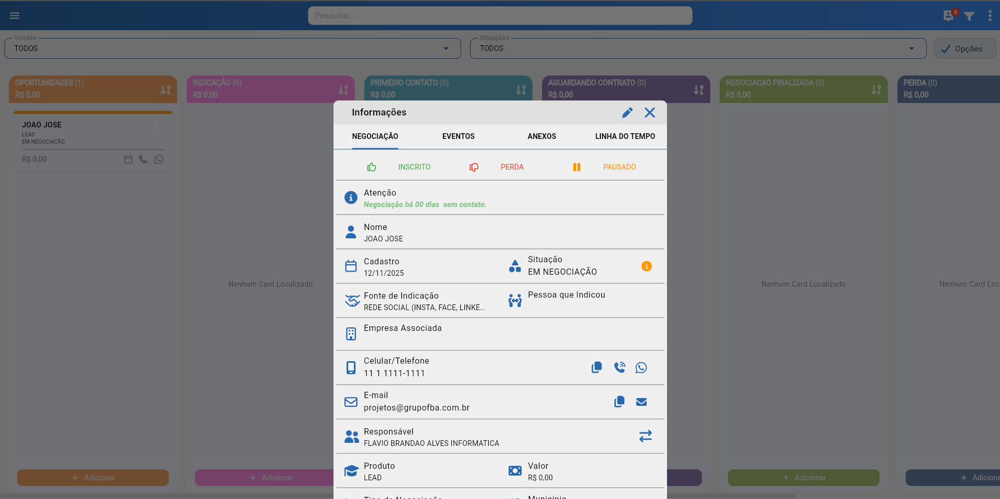

### Eventos

Permite a visualização dos eventos realizados para aquela negociação. (Veja mais sobre em [Eventos](../../routes/events/events.md)).

### Anexos

Permite a adição, _download_ e visualização de anexos na negociação.

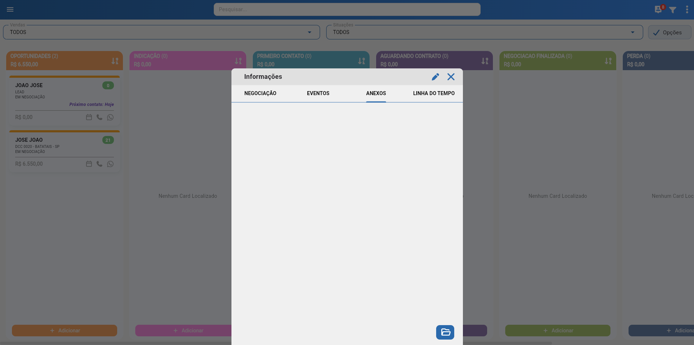

### Linha do tempo

Exibe as movimentações feitas com essa negociação ao longo do processo de venda.

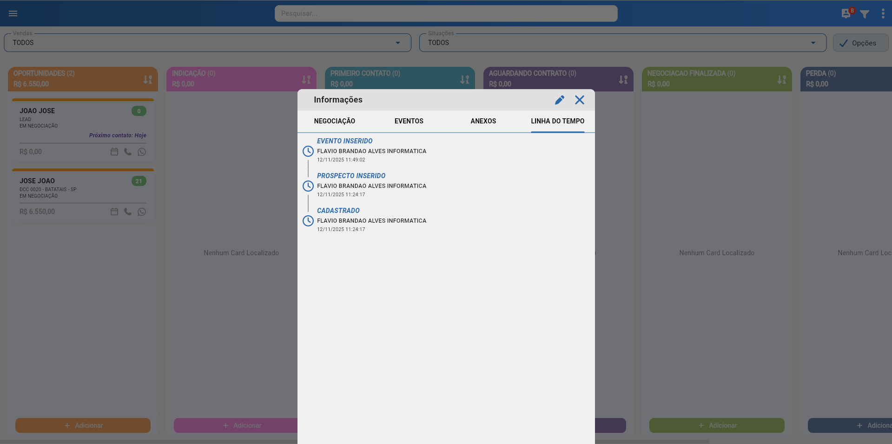