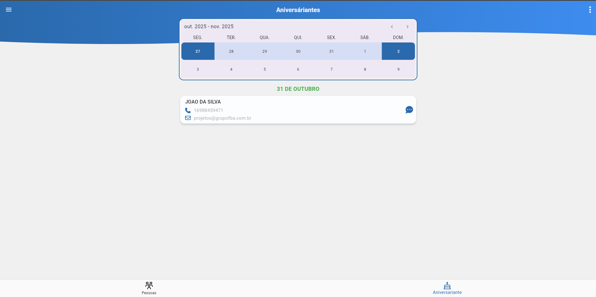

# Aniversariantes

A tela de **Aniversariantes** exibe os aniversários de acordo com a carteira de clientes do usuário.  
Para usuários **Master** e **Gestores de equipe**, são exibidos todos os registros pertencentes aos usuários sob sua permissão. 
Essa funcionalidade permite que o usuário envie mensagens personalizadas parabenizando o prospecto ou participante.

A tela traz uma filtragem por período, sempre exibindo uma faixa de dias equivalente à semana selecionada.

Ao clicar no botão de envio de mensagens, é exibida a mensagem padrão de [_configurações_](../../routes/settings/settings.md), permitindo ao usuário editar e enviar algo específico para aquela pessoa.

**Observação:** A exibição das informações dentro da pessoa é um espelho da tela ao lado.  
Para mais detalhes, consulte [_Informações_](./people.md).
