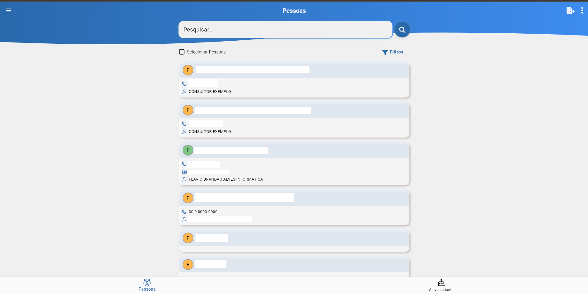
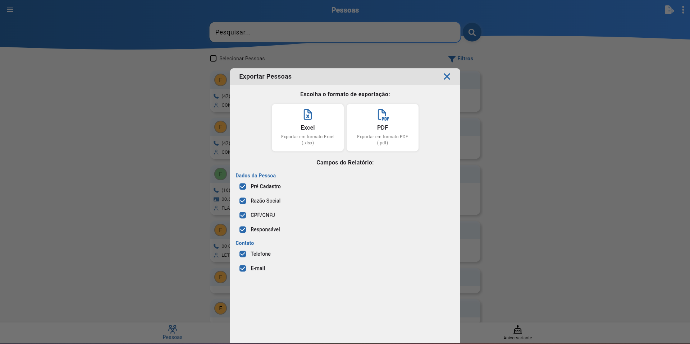
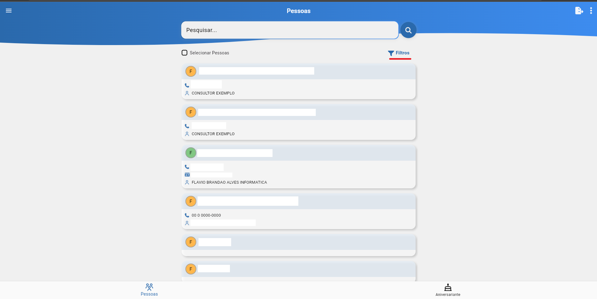
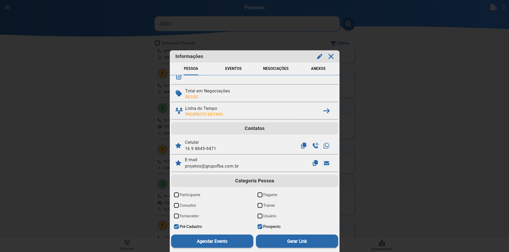
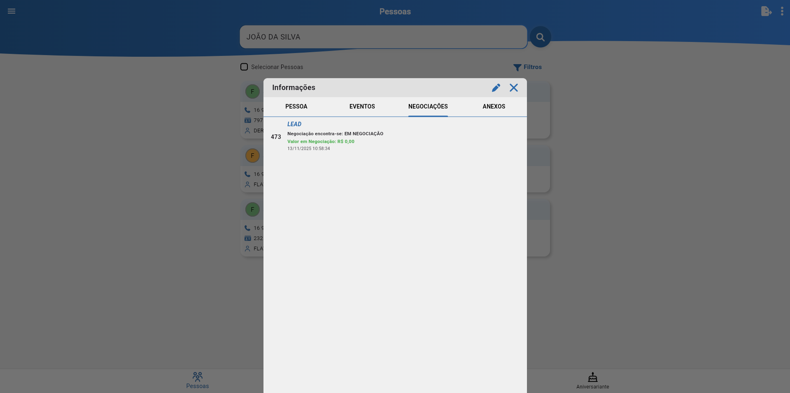

# Pessoas

A tela de **Gestão de Pessoas** é responsável pelo gerenciamento da carteira de clientes dos usuários cadastrados no sistema.  
Nela, é possível visualizar registros realizados em negociações de pessoas vinculadas às operações comerciais e administrativas do **SIGAFBA Treinamentos CRM**.

O objetivo dessa área é centralizar as informações de contato, dados pessoais e vínculos funcionais, permitindo um controle eficiente sobre quem participa dos processos de vendas, treinamentos e negociações.

## Pesquisar

Barra de busca responsável por trazer as pessoas de acordo com o que está sendo filtrado.

## Exportar

Permite exportar a carteira de clientes em _PDF_ ou _Excel_, com filtragem de dados.

## Seleção de pessoas

A **seleção de pessoas** permite ao usuário marcar vários ou todos os registros e fazer movimentações referentes à sua carteira de clientes de maneira agrupada, permitindo enviar mensagens por e-mail e _WhatsApp_ ou realizar a troca de responsável*.

_*Observação: Para a realização da alteração do responsável, é necessário ter a permissão de Master ou Gestor de equipe._

## Filtros

A tela de **Filtros** permite realizar buscas parametrizadas entre os cadastros, facilitando o gerenciamento e a localização de informações específicas dentro do módulo de pessoas.

## Informações

Ao abrir o cadastro de informações de uma pessoa, serão exibidas quatro abas:

- [Pessoa](#pessoa)
- [Eventos](#eventos)
- [Negociações](#negociações)
- [Anexos](#anexos)

### Pessoa

A tela de **Pessoa** é onde serão exibidos os dados preenchidos através da negociação, a respeito do prospecto ou participante, permitindo a edição, contato rápido, agendamento de eventos e geração de links.

### Eventos

Exibe os eventos realizados e/ou pendentes para aquela pessoa, com data, assunto e observações.

### Negociações

Exibe as negociações já feitas e/ou em andamento com a pessoa.

### Anexos

Exibe todos os anexos vinculados anteriormente em negociações para aquela pessoa, permitindo a visualização e o _download_.

