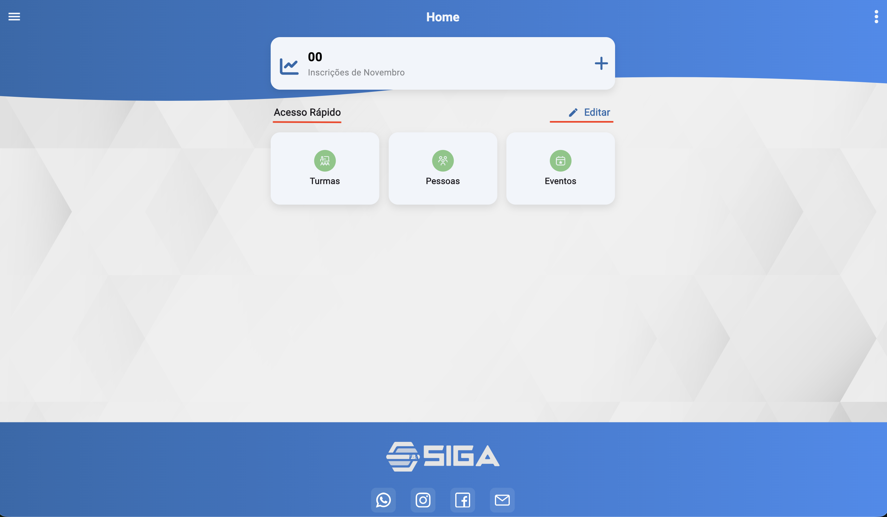
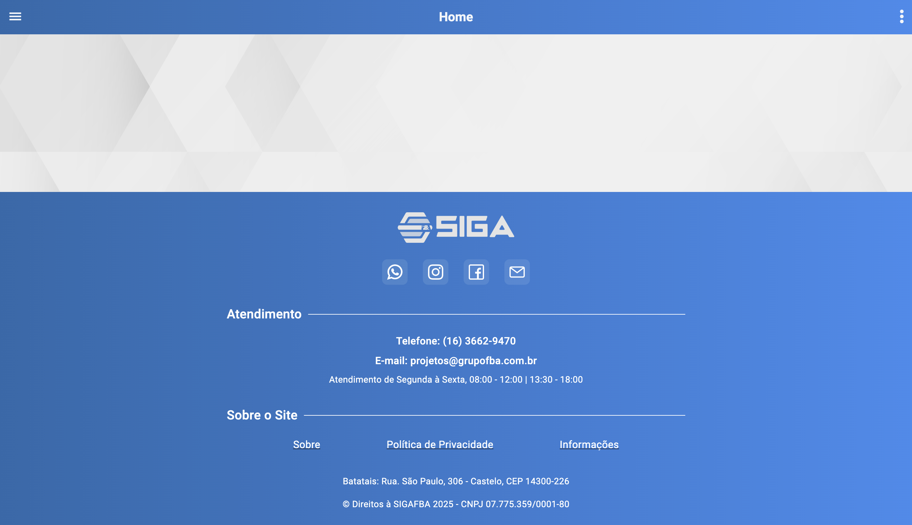

# Início (/inicio)

## Resumo
Tela inicial com visão geral do sistema e atalhos.

## Principais Ações
- Criar links rapidamente.
- Configurar menus do acesso rápido.
- Visualizar vendas do mês (consultores).

## Menu Principal (Consultores)
- Exibe o número de vendas realizadas no mês atual.
- Disponibiliza um botão/atalho para criação rápida de links.

## Acesso Rápido
- Área de atalhos configurável pelo usuário para agilizar a navegação.
- O usuário define quais menus devem aparecer na tela inicial.

## Editar Acesso Rápido — Configurações
Ao clicar no botão “Editar” do acesso rápido, estão disponíveis:
- Acesso rápido: selecionar rotas que serão exibidas na tela de início.
- Rota inicial: definir qual rota o sistema abre ao entrar.
- Rota favorita: fixar uma rota no menu principal do sistema.

## Rodapé
- Exibe links para redes sociais e informações de contato.
- Facilita suporte e comunicação.

## Mensagens e Erros Comuns
- Falha ao carregar indicadores.
- Permissões insuficientes.
- Falha ao carregar vendas do mês.
- Erro ao salvar configurações do acesso rápido.

## Relacionados
- Configuração (`/configuracao`)
- Financeiro v2 (`/financeiro/v2`)