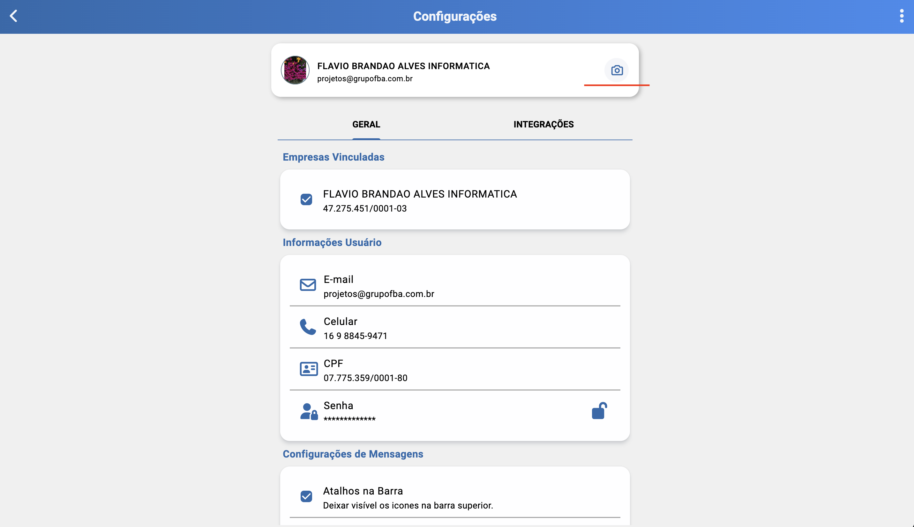
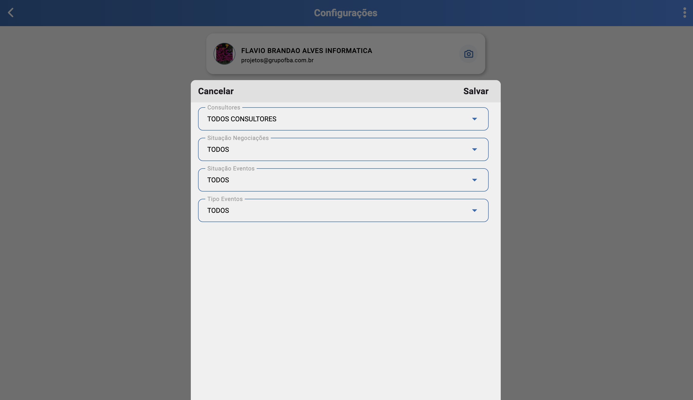
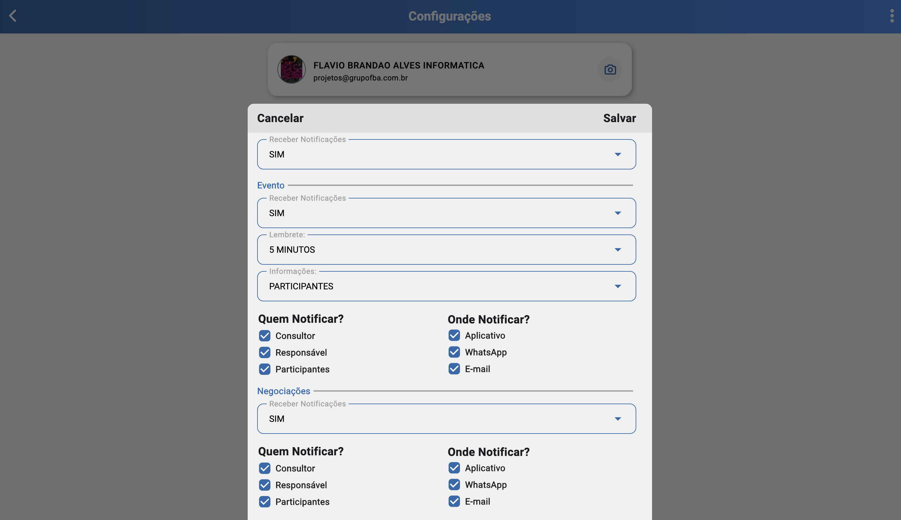

# Configuração (/configuracao)

## Resumo
Central de ajustes do sistema (parâmetros, integrações, perfis).

## Perfil e Credenciais
- Exibe e permite visualizar/editar: e-mail, celular, CPF, empresas vinculadas, nome e foto de perfil.
- Essas informações são utilizadas para identificação do usuário em todo o sistema/app.

## Foto de Perfil
- É possível alterar a foto de perfil que será utilizada nas demais telas do sistema/app.
- A alteração suporta upload e pré-visualização; após salvar, passa a valer globalmente.

### Configurar Usuário
- Personalizar os itens que aparecerão na busca de pessoas dentro do sistema.
- Definir a mensagem padrão de aniversário (pré-carregada ao enviar mensagem para aniversariante).
- Definir a mensagem padrão para envio via WhatsApp.

### Configurações de Menu
- Configurar qual tela será iniciada ao efetuar o login (rota inicial).
- Definir a rota favorita, que fica fixa no menu superior para acesso fácil.

### Configuração de Filtros
- Opções para configurar filtros padrões no sistema, inicializados por padrão a cada carregamento.

### Configuração de Notificações
- Possibilidade de habilitar as notificações do sistema como o envio de mensagens via whatsapp/e-mai, novos leads em negociações e eventos futuros.

### Configurar Negociações
- Configurar cards e visualizações dentro das negociações para facilitar reconhecimento e destaque de informações importantes.

## Relacionados
- Início (`/inicio`)