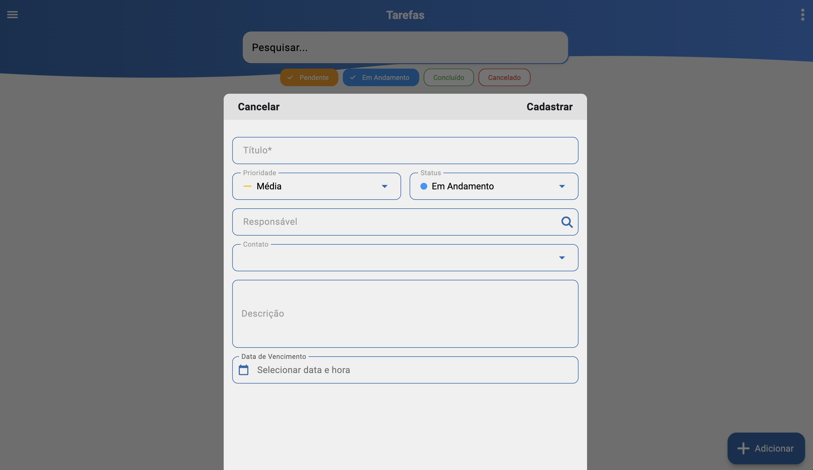

# Tarefas (/tarefas)

## Resumo
Tela para consulta, organização e atualização de tarefas do usuário. Permite filtrar por descrição e status, listar com prioridade e responsável, editar dados e criar novas tarefas conforme necessidade.

## Filtros
- Descrição: busca textual por título/descrição da tarefa.
- Status: seleção entre `pendente`, `em andamento`, `concluído`, `cancelado`.

## Listagem de Tarefas
Cada item (card) exibe:

- Descrição/Título da tarefa.
- Prioridade: `baixa`, `média`, `alta`, `urgente`.
- Usuário responsável.
- Status atual (alterável diretamente no card).

## Edição da Tarefa
Ao clicar em um card:

- Edita informações existentes (descrição, prioridade, status, responsável, contato, observações, data de vencimento).
- Adiciona novas informações/observações conforme andamento.

## Adicionar Nova Tarefa
Campos:

- Título (descrição) da tarefa.
- Prioridade: `baixa`, `média`, `alta`, `urgente`.
- Status: `pendente`, `em andamento`, `concluído`, `cancelado`.
- Responsável: pessoa designada (se o usuário for gestor).
- Contato: forma de contato vinculada (opção cadastrável no SIGAFBA ERP).
- Descrição detalhada: informações necessárias para execução.
- Data de vencimento: quando deve ser concluída (opcional; tarefas podem não ter prazo).

## Relacionados
- Início (`/inicio`)